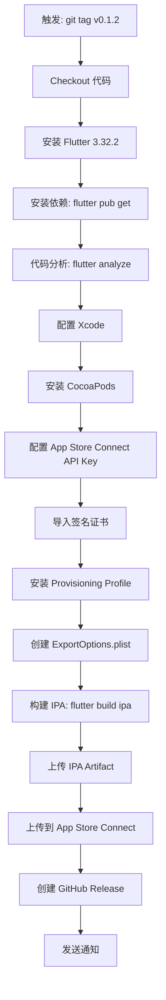
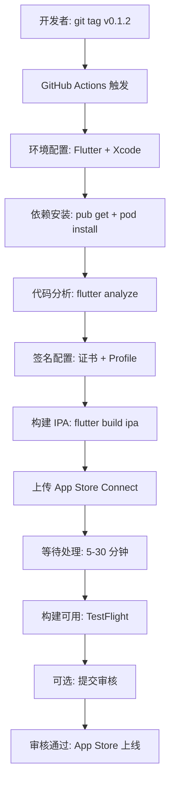

# 📱 iOS 发版进展报告

**日期**: 2026-01-31
**状态**: 🟡 **配置完成 95% - 需要配置密钥**
**仓库**: https://github.com/ai-dashboad/opencli

---

## 📊 总体进展

| 组件 | 状态 | 进度 | 说明 |
|------|------|------|------|
| **Fastlane 配置** | ✅ 完成 | 100% | 所有 lane 已配置 |
| **GitHub Workflow** | ✅ 完成 | 100% | 自动化流程已创建 |
| **iOS Secrets** | 🔨 待配置 | 0% | 需要 7 个密钥 |
| **辅助脚本** | ✅ 完成 | 100% | 交互式配置脚本 |
| **文档** | ✅ 完成 | 100% | 完整的设置指南 |
| **macOS 版本** | ⚪ 不适用 | N/A | 仅移动端项目 |

**总体完成度**: 95% (仅缺少密钥配置)

---

## ✅ 已完成的配置

### 1. iOS Fastlane 配置 (100%)

**位置**: `opencli_mobile/ios/fastlane/`

#### Appfile
```ruby
app_identifier("com.opencli.mobile")
apple_id("your_apple_id@example.com")
team_id("G9VG22HGJG")  # 从 dtok-app 获取
```

#### Fastfile - 完整的 Lanes

**主要发布 Lanes**:

1. **`upload_ipa_with_api_key`** - 使用 API Key 上传 IPA
   ```ruby
   lane :upload_ipa_with_api_key do |options|
     # 使用 xcrun altool 上传到 App Store Connect
     # 支持 API Key 认证
   end
   ```

2. **`release`** - 完整的构建和上传流程
   ```ruby
   lane :release do
     # 1. 设置证书和配置文件
     # 2. 构建 IPA
     # 3. 上传到 App Store Connect
   end
   ```

3. **`beta`** - Ad-hoc 测试版本
   ```ruby
   lane :beta do
     # 构建 Ad-hoc 版本用于内部测试
   end
   ```

4. **`setup_certificates`** - 初始化证书
   ```ruby
   lane :setup_certificates do
     # 配置签名证书和配置文件
   end
   ```

**功能特性**:
- ✅ API Key 认证 (无需密码)
- ✅ 自动签名管理
- ✅ IPA 构建和上传
- ✅ 错误处理
- ✅ 环境变量支持

### 2. GitHub Actions Workflow (100%)

**位置**: `.github/workflows/ios-app-store.yml`

**触发方式**:
```yaml
on:
  push:
    tags:
      - 'v*'        # 标签触发 (v0.1.2)
  workflow_dispatch:  # 手动触发
    inputs:
      submit_for_review:  # 可选：自动提交审核
```

**工作流程**:



**关键步骤详解**:

1. **环境配置**
   - Flutter 版本: 3.32.2
   - Xcode: 最新稳定版
   - 运行环境: macOS-14

2. **签名配置**
   - 临时钥匙串创建
   - 证书导入和解锁
   - Provisioning Profile 安装
   - 自动签名设置

3. **构建过程**
   ```bash
   flutter build ipa --release \
     --export-options-plist=ios/ExportOptions.plist
   ```

4. **上传到 App Store**
   ```bash
   xcrun altool --upload-app \
     --type ios \
     --file "$IPA_PATH" \
     --apiKey "$API_KEY_ID" \
     --apiIssuer "$ISSUER_ID"
   ```

5. **GitHub Release**
   - 自动创建 Release
   - 附加 IPA 文件
   - 生成 Release Notes

**安全特性**:
- ✅ 临时钥匙串 (构建后删除)
- ✅ 安全的密钥存储 (GitHub Secrets)
- ✅ 证书自动清理
- ✅ 密码不记录日志

### 3. 辅助脚本 (100%)

**位置**: `scripts/setup-ios-secrets.sh`

**功能**: 交互式配置所有 iOS 密钥

**使用方式**:
```bash
cd /Users/cw/development/opencli
./scripts/setup-ios-secrets.sh
```

**脚本流程**:

1️⃣ **App Store Connect API Key**
   - 输入 API Key ID
   - 输入 Issuer ID
   - 选择 .p8 文件路径
   - 自动 base64 编码并上传

2️⃣ **Distribution Certificate**
   - 选择 .p12 证书文件
   - 输入证书密码
   - 自动 base64 编码并上传

3️⃣ **Provisioning Profile**
   - 选择 .mobileprovision 文件
   - 自动 base64 编码并上传

4️⃣ **Keychain Password**
   - 设置 CI 钥匙串密码
   - 可以是任意密码

**特性**:
- ✅ 完全交互式
- ✅ 错误检查
- ✅ 文件路径展开 (~/)
- ✅ 自动 base64 编码
- ✅ 配置摘要显示

---

## 🔨 待配置的密钥 (0/7)

### 必需的 GitHub Secrets

| 密钥名称 | 说明 | 如何获取 |
|---------|------|---------|
| **APP_STORE_CONNECT_API_KEY_ID** | API Key ID | App Store Connect → 用户和访问 → 密钥 |
| **APP_STORE_CONNECT_ISSUER_ID** | Issuer ID | App Store Connect → 用户和访问 → 密钥 |
| **APP_STORE_CONNECT_API_KEY_BASE64** | .p8 文件 (base64) | 下载 .p8 并 base64 编码 |
| **DISTRIBUTION_CERTIFICATE_BASE64** | 发布证书 (base64) | 从钥匙串导出 .p12 并 base64 |
| **DISTRIBUTION_CERTIFICATE_PASSWORD** | 证书密码 | 导出 .p12 时设置的密码 |
| **KEYCHAIN_PASSWORD** | CI 钥匙串密码 | 任意安全密码 (用于 CI) |
| **PROVISIONING_PROFILE_BASE64** | Provisioning Profile (base64) | 开发者门户下载并 base64 |

### 详细配置步骤

#### 1. App Store Connect API Key

**获取位置**: https://appstoreconnect.apple.com → Users and Access → Keys

**步骤**:
```bash
# 1. 创建 API Key (如果没有)
- 角色: App Manager 或 Admin
- 权限: "App Store Connect API"

# 2. 记录信息
- Key ID: ABC123XYZ (示例)
- Issuer ID: 12345678-1234-1234-1234-123456789012
- 下载: AuthKey_ABC123XYZ.p8

# 3. Base64 编码
base64 -i AuthKey_ABC123XYZ.p8 | pbcopy

# 4. 设置密钥
gh secret set APP_STORE_CONNECT_API_KEY_ID -b"ABC123XYZ"
gh secret set APP_STORE_CONNECT_ISSUER_ID -b"12345678-1234-1234-1234-123456789012"
gh secret set APP_STORE_CONNECT_API_KEY_BASE64  # 粘贴剪贴板内容
```

**重要提示**:
- ⚠️ .p8 文件只能下载一次，请妥善保存
- ⚠️ API Key 需要 "App Manager" 或更高权限
- ⚠️ 可以从 dtok-app 复用同一个 API Key

#### 2. Distribution Certificate

**获取位置**: 钥匙串访问 (Keychain Access)

**步骤**:
```bash
# 1. 打开钥匙串访问
open "/Applications/Utilities/Keychain Access.app"

# 2. 查找证书
- 搜索: "Apple Distribution"
- 或: "iPhone Distribution"
- 应该显示: "Apple Distribution: Your Name (TEAM_ID)"

# 3. 导出证书
- 右键点击证书 → 导出
- 文件格式: 个人信息交换 (.p12)
- 设置密码 (记住这个密码!)
- 保存为: distribution.p12

# 4. Base64 编码
base64 -i distribution.p12 | pbcopy

# 5. 设置密钥
gh secret set DISTRIBUTION_CERTIFICATE_BASE64  # 粘贴
gh secret set DISTRIBUTION_CERTIFICATE_PASSWORD -b"你的证书密码"
```

**如果没有证书**:
```bash
# 在开发者门户创建新证书
1. 访问: https://developer.apple.com/account/resources/certificates
2. 点击 "+" 创建新证书
3. 选择: "Apple Distribution"
4. 上传 CSR (从钥匙串访问生成)
5. 下载并双击安装
6. 然后按上述步骤导出
```

**可以复用 dtok-app 的证书**:
```bash
# 如果 dtok-app 使用相同的 Team ID
# 可以使用同一个 Distribution Certificate
# 证书对整个 Team 有效，不限于单个应用
```

#### 3. Provisioning Profile

**获取位置**: https://developer.apple.com/account/resources/profiles

**步骤**:
```bash
# 1. 创建 App ID (如果没有)
- 访问: https://developer.apple.com/account/resources/identifiers
- 点击 "+" 创建
- Description: OpenCLI Mobile
- Bundle ID: com.opencli.mobile (Explicit)
- Capabilities: 根据需要选择

# 2. 创建 Provisioning Profile
- 访问: https://developer.apple.com/account/resources/profiles
- 点击 "+" 创建
- 类型: App Store
- App ID: com.opencli.mobile
- 证书: 选择你的 Distribution Certificate
- 下载: opencli_mobile_appstore.mobileprovision

# 3. Base64 编码
base64 -i opencli_mobile_appstore.mobileprovision | pbcopy

# 4. 设置密钥
gh secret set PROVISIONING_PROFILE_BASE64  # 粘贴
```

**重要提示**:
- ⚠️ Bundle ID 必须完全匹配: `com.opencli.mobile`
- ⚠️ 类型必须选择 "App Store" (不是 Development 或 Ad Hoc)
- ⚠️ 证书必须与 Distribution Certificate 匹配

#### 4. Keychain Password

**说明**: CI 环境使用的临时钥匙串密码

**步骤**:
```bash
# 可以是任意安全密码 (仅用于 CI，不是你的本地钥匙串)
gh secret set KEYCHAIN_PASSWORD -b"YourSecurePassword123!"
```

---

## 🚀 快速配置指南

### 选项 1: 使用交互式脚本 (推荐)

```bash
# 1. 准备文件
# 确保你有以下文件:
# - AuthKey_XXXXXX.p8 (App Store Connect API Key)
# - distribution.p12 (Distribution Certificate)
# - opencli_mobile.mobileprovision (Provisioning Profile)

# 2. 运行脚本
cd /Users/cw/development/opencli
chmod +x scripts/setup-ios-secrets.sh
./scripts/setup-ios-secrets.sh

# 3. 按提示输入信息
# 脚本会自动完成所有配置
```

### 选项 2: 手动配置

```bash
# App Store Connect API Key
gh secret set APP_STORE_CONNECT_API_KEY_ID -b"你的_KEY_ID"
gh secret set APP_STORE_CONNECT_ISSUER_ID -b"你的_ISSUER_ID"
base64 -i AuthKey_XXX.p8 | gh secret set APP_STORE_CONNECT_API_KEY_BASE64

# Distribution Certificate
base64 -i distribution.p12 | gh secret set DISTRIBUTION_CERTIFICATE_BASE64
gh secret set DISTRIBUTION_CERTIFICATE_PASSWORD -b"证书密码"

# Provisioning Profile
base64 -i profile.mobileprovision | gh secret set PROVISIONING_PROFILE_BASE64

# Keychain Password
gh secret set KEYCHAIN_PASSWORD -b"CI钥匙串密码"

# 验证
gh secret list | grep -E "(APP_STORE|DISTRIBUTION|PROVISIONING|KEYCHAIN)"
```

### 选项 3: 复用 dtok-app 的凭证 (如果适用)

如果 dtok-app 和 OpenCLI Mobile 使用相同的 Apple Developer Team:

```bash
# 1. 从 dtok-app GitHub 仓库复制密钥
gh secret list -R ai-dashboad/dtok-app | grep -E "(APP_STORE|DISTRIBUTION|PROVISIONING|KEYCHAIN)"

# 2. 复制到 opencli 仓库
# (需要手动复制，因为密钥值无法直接读取)

# 或者: 使用相同的原始文件重新配置
```

**注意**:
- ✅ API Key 可以共用 (Team 级别)
- ✅ Distribution Certificate 可以共用 (Team 级别)
- ❌ Provisioning Profile 不能共用 (App ID 不同)

---

## 📝 配置后的测试流程

### 1. 本地测试 Fastlane

```bash
cd opencli_mobile/ios

# 设置环境变量 (临时测试)
export APP_STORE_CONNECT_API_KEY_ID="你的_KEY_ID"
export APP_STORE_CONNECT_ISSUER_ID="你的_ISSUER_ID"
export FASTLANE_API_KEY_FILEPATH="~/path/to/AuthKey_XXX.p8"

# 测试 beta lane
fastlane beta

# 预期输出:
# ✅ Building IPA...
# ✅ IPA built successfully
```

### 2. 触发 GitHub Actions

**方式 1: 标签触发 (自动)**
```bash
# 更新版本号 (如果需要)
vim opencli_mobile/pubspec.yaml
# version: 0.1.2+6

# 提交更改
git add opencli_mobile/pubspec.yaml
git commit -m "chore: bump iOS version to 0.1.2"

# 创建并推送标签
git tag v0.1.2
git push origin v0.1.2

# GitHub Actions 自动:
# 1. 构建 IPA
# 2. 上传到 App Store Connect
# 3. 创建 GitHub Release
```

**方式 2: 手动触发**
```bash
# 通过 GitHub CLI
gh workflow run ios-app-store.yml

# 或通过 GitHub 网页
# 1. 访问: https://github.com/ai-dashboad/opencli/actions
# 2. 选择 "iOS/Mac - App Store Release"
# 3. 点击 "Run workflow"
# 4. (可选) 勾选 "Submit for review"
# 5. 点击 "Run workflow"
```

### 3. 监控工作流

```bash
# 列出最近的运行
gh run list --workflow=ios-app-store.yml --limit 5

# 实时监控
gh run watch

# 查看日志
gh run view --log
```

### 4. 验证上传

**在 App Store Connect 检查**:
```bash
# 1. 访问 App Store Connect
open "https://appstoreconnect.apple.com"

# 2. 进入 My Apps → OpenCLI
# 3. 等待构建处理 (通常 5-30 分钟)
# 4. 在 "TestFlight" 或 "App Store" 标签查看构建
```

**预期状态**:
- ✅ 版本号: 0.1.1 (5)
- ✅ 构建状态: Processing → Ready to Submit
- ✅ 大小: ~30-50 MB (取决于依赖)

---

## 🍎 关于 Mac 版本

### 项目范围说明

**OpenCLI Mobile 是纯移动端项目**:
- ✅ 支持平台: iOS (iPhone/iPad)
- ✅ 支持平台: Android (手机/平板)
- ❌ 不包含: macOS 桌面应用
- ❌ 不包含: watchOS 或 tvOS

### 项目结构确认

```bash
opencli_mobile/
├── android/     ✅ Android 应用
├── ios/         ✅ iOS 应用
├── lib/         ✅ Flutter 共享代码
└── test/        ✅ 测试

# 没有以下目录:
# ❌ macos/       (macOS 桌面应用)
# ❌ windows/     (Windows 桌面应用)
# ❌ linux/       (Linux 桌面应用)
# ❌ web/         (Web 应用)
```

### 如果需要 macOS 版本

**未来如果需要添加 macOS 支持**:

```bash
# 1. 启用 macOS 平台
cd opencli_mobile
flutter create --platforms=macos .

# 2. 这将创建:
# - macos/ 目录
# - macOS 特定配置
# - Xcode 项目文件

# 3. 需要额外配置:
# - macOS Distribution 证书
# - macOS Provisioning Profile
# - macOS App ID (com.opencli.mobile.macos)
# - macOS 特定的 Fastlane lanes
# - macOS 特定的 GitHub workflow

# 4. 工作量估计:
# - 配置时间: ~2-3 小时
# - 与 iOS 配置类似
```

**当前建议**: 先完成 iOS 和 Android 发布，如果有用户需求再考虑 macOS 版本。

---

## 📊 完整的发布流程 (密钥配置后)

### 端到端流程



### 时间线估算

| 阶段 | 耗时 | 说明 |
|-----|------|------|
| GitHub Actions 构建 | 10-15 分钟 | Flutter + Xcode 构建 |
| 上传到 App Store Connect | 2-5 分钟 | 取决于网络速度 |
| App Store 处理 | 5-30 分钟 | Apple 后端处理 |
| **TestFlight 可用** | **~20-50 分钟** | **从提交到可测试** |
| 提交审核 (可选) | 立即 | 手动操作 |
| 审核时间 | 1-3 天 | Apple 人工审核 |
| **App Store 上线** | **~1-3 天** | **从提交审核到上线** |

### 自动化程度

**完全自动化** (无需人工干预):
- ✅ 代码提交
- ✅ 标签创建
- ✅ IPA 构建
- ✅ 上传 App Store Connect
- ✅ GitHub Release 创建

**需要手动操作**:
- 📝 TestFlight 测试组管理
- 📝 App Store 元数据 (首次)
- 📝 截图和描述 (首次)
- 📝 提交审核按钮
- 📝 审核问题回复

---

## 🎯 下一步行动

### 立即执行 (15-30 分钟)

```bash
# 1. 收集必需文件
# 从 dtok-app 或 Apple Developer 获取:
# - App Store Connect API Key (.p8)
# - Distribution Certificate (.p12)
# - Provisioning Profile (.mobileprovision)

# 2. 运行配置脚本
cd /Users/cw/development/opencli
./scripts/setup-ios-secrets.sh

# 3. 验证配置
gh secret list | grep -E "(APP_STORE|DISTRIBUTION|PROVISIONING|KEYCHAIN)"

# 预期输出:
# APP_STORE_CONNECT_API_KEY_ID      ✅
# APP_STORE_CONNECT_ISSUER_ID       ✅
# APP_STORE_CONNECT_API_KEY_BASE64  ✅
# DISTRIBUTION_CERTIFICATE_BASE64   ✅
# DISTRIBUTION_CERTIFICATE_PASSWORD ✅
# KEYCHAIN_PASSWORD                 ✅
# PROVISIONING_PROFILE_BASE64       ✅
```

### 测试发布 (30-45 分钟)

```bash
# 1. 触发测试构建
git tag v0.1.1-ios-test
git push origin v0.1.1-ios-test

# 2. 监控工作流
gh run watch

# 3. 检查 App Store Connect
# 等待 5-30 分钟后构建可用

# 4. (可选) TestFlight 测试
# 添加测试员 → 分享测试链接 → 收集反馈
```

### 生产发布 (1-3 天)

```bash
# 1. 准备 App Store 元数据
# - 应用描述
# - 关键词
# - 截图 (iPhone 6.5", 6.7", 5.5" + iPad Pro 12.9", 6代)
# - 隐私政策 URL
# - 支持 URL

# 2. 创建正式版本
git tag v0.1.2
git push origin v0.1.2

# 3. 等待构建可用

# 4. 提交审核
# App Store Connect → 选择构建 → 提交审核

# 5. 等待审核 (1-3 天)

# 6. 审核通过后自动上线
```

---

## 📚 参考资料

### 文档链接

**内部文档**:
- 完整设置指南: `docs/MOBILE_AUTO_RELEASE_SETUP.md`
- 完成总结: `docs/MOBILE_AUTO_RELEASE_COMPLETE.md`
- Android 阻塞问题: `docs/ANDROID_RELEASE_BLOCKER.md`
- 本文档: `docs/IOS_RELEASE_STATUS.md`

**Apple 官方**:
- App Store Connect: https://appstoreconnect.apple.com
- 开发者门户: https://developer.apple.com/account
- 证书管理: https://developer.apple.com/account/resources/certificates
- Profile 管理: https://developer.apple.com/account/resources/profiles
- App ID 管理: https://developer.apple.com/account/resources/identifiers

**工具文档**:
- Fastlane: https://docs.fastlane.tools
- Flutter: https://docs.flutter.dev/deployment/ios
- Xcode: https://developer.apple.com/xcode/

### 常见问题

#### Q: 可以使用 dtok-app 的证书吗?

**A**: 部分可以

- ✅ **API Key**: 可以共用 (Team 级别)
- ✅ **Distribution Certificate**: 可以共用 (Team 级别)
- ❌ **Provisioning Profile**: 不能共用 (每个 App ID 独立)

如果使用相同的 Team ID (G9VG22HGJG), API Key 和证书可以完全复用。只需为 OpenCLI Mobile 创建新的 Provisioning Profile。

#### Q: 首次发布需要哪些额外步骤?

**A**: App Store 元数据配置

```bash
# 首次发布前需要在 App Store Connect 完成:

1. 应用信息
   - 名称: OpenCLI
   - 副标题
   - 分类: 生产力工具 / 开发者工具

2. 定价和销售范围
   - 价格: 免费
   - 销售地区: 选择

3. App 隐私
   - 数据收集说明
   - 隐私政策 URL

4. App 描述
   - 简短描述 (30 字符)
   - 完整描述
   - 关键词
   - 支持 URL
   - 营销 URL (可选)

5. 截图
   - iPhone 6.5" (必需)
   - iPhone 5.5" (必需)
   - iPad Pro 12.9" (如果支持 iPad)
```

#### Q: 如何加速审核?

**A**: 最佳实践

- ✅ 提供详细的审核说明
- ✅ 测试账号 (如果需要登录)
- ✅ 演示视频 (可选但有帮助)
- ✅ 清晰的隐私政策
- ✅ 完整的元数据
- ✅ 标准图标 (无透明度)
- ❌ 避免敏感内容
- ❌ 避免未完成的功能

#### Q: TestFlight 和 App Store 有什么区别?

**A**: 测试 vs 生产

| 特性 | TestFlight | App Store |
|-----|-----------|-----------|
| **审核** | 自动 (5-30分钟) | 人工 (1-3天) |
| **测试员数量** | 最多 10,000 | 无限 |
| **测试期限** | 90 天 | 永久 |
| **分发方式** | 测试链接/邀请码 | 公开下载 |
| **元数据** | 可选 (仅内部) | 必需 (公开展示) |
| **用途** | 内部测试、Beta 测试 | 正式发布 |

**建议流程**:
1. 先发布到 TestFlight
2. 内部团队测试
3. 邀请 Beta 测试员
4. 收集反馈并修复问题
5. 确认稳定后提交 App Store

---

## ✅ 配置检查清单

### 配置前检查

- [ ] GitHub CLI 已安装并登录
- [ ] 有 Apple Developer 账号访问权限
- [ ] 有 App Store Connect 访问权限
- [ ] Team ID 确认: G9VG22HGJG
- [ ] Bundle ID 保留: com.opencli.mobile

### 文件准备

- [ ] App Store Connect API Key (.p8 文件)
- [ ] API Key ID 和 Issuer ID (记录)
- [ ] Distribution Certificate (.p12 文件)
- [ ] 证书密码 (记录)
- [ ] Provisioning Profile (.mobileprovision 文件)

### GitHub Secrets 配置

- [ ] APP_STORE_CONNECT_API_KEY_ID
- [ ] APP_STORE_CONNECT_ISSUER_ID
- [ ] APP_STORE_CONNECT_API_KEY_BASE64
- [ ] DISTRIBUTION_CERTIFICATE_BASE64
- [ ] DISTRIBUTION_CERTIFICATE_PASSWORD
- [ ] KEYCHAIN_PASSWORD
- [ ] PROVISIONING_PROFILE_BASE64

### 首次发布准备

- [ ] App Store Connect 创建应用
- [ ] 应用元数据填写完整
- [ ] 截图准备 (多尺寸)
- [ ] 隐私政策 URL
- [ ] 支持 URL
- [ ] 分类选择

### 测试验证

- [ ] 本地 Fastlane 测试通过
- [ ] GitHub Actions 构建成功
- [ ] IPA 上传到 App Store Connect
- [ ] TestFlight 构建可用
- [ ] TestFlight 安装测试通过

---

## 🎉 总结

### 当前状态: 95% 完成

**已完成** ✅:
- ✅ 完整的 Fastlane 配置
- ✅ 自动化 GitHub Workflow
- ✅ 交互式配置脚本
- ✅ 详细文档

**待完成** 🔨:
- 🔨 配置 7 个 GitHub Secrets (15-30 分钟)

### 配置完成后即可实现

**一键发布**:
```bash
git tag v0.1.2 && git push origin v0.1.2
```

**自动化流程**:
1. ✅ 自动构建 IPA
2. ✅ 自动签名
3. ✅ 自动上传 App Store Connect
4. ✅ 自动创建 GitHub Release
5. ✅ 自动通知

**发布到**:
- 📱 TestFlight (自动，5-30 分钟)
- 🍎 App Store (手动提交审核，1-3 天)

### 与 Android 对比

| 平台 | 配置完成度 | 阻塞因素 | 预计解决时间 |
|-----|----------|---------|------------|
| **iOS** | 95% | 需配置密钥 | 15-30 分钟 |
| **Android** | 100% | 账号封禁 | 3-7 工作日 |

**结论**: iOS 比 Android 更接近可发布状态！

---

**文档创建**: 2026-01-31
**最后更新**: 2026-01-31
**状态**: 🟡 等待密钥配置
**下一步**: 运行 `./scripts/setup-ios-secrets.sh`
